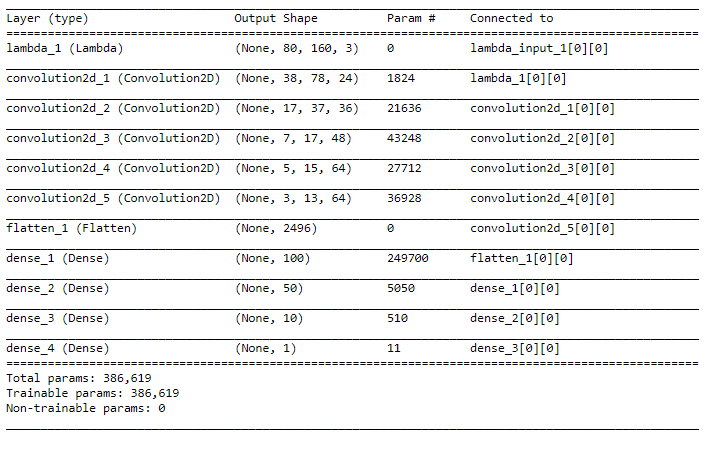
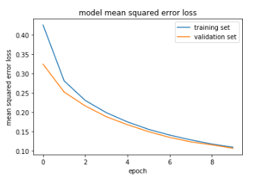

# **Behavioral Cloning** 


## Goals

The goals / steps of this project are the following:
* Use the simulator to collect data of good driving behavior
* Build, a convolution neural network in Keras that predicts steering angles from images
* Train and validate the model with a training and validation set
* Test that the model successfully drives around track one without leaving the road
* Summarize the results with a written report


## Rubric Points
### Here I will consider the [rubric points](https://review.udacity.com/#!/rubrics/432/view) individually and describe how I addressed each point in my implementation.  

---
### Files Submitted & Code Quality

#### 1. Submission includes all required files and can be used to run the simulator in autonomous mode

My project includes the following files:
* **model.py**: contains the script to create and train the model
* **drive.py**: drives the car in autonomous mode. 
* **model.h5**: contains a trained convolution neural network
* **video.mp4**: a video recording where the vehicle drives autonomously at least one lap around the track
* **writeup_report.md**: summarizing the results

#### 2. Submission includes functional code
Using the Udacity provided simulator and my drive.py file, the car can be driven autonomously around the track by executing 
```sh
python drive.py model.h5
```
I made the following changes:
* set_speed = 20 (line 47)
* image resized to 80 x 160 (line 66)

#### 3. Submission code is usable and readable

The model.py file contains the code for training and saving the convolution neural network. The file shows the pipeline I used for training and validating the model, and it contains comments to explain how the code works. 


### Model Architecture and Training Strategy

#### 1. Solution Design Approach

The overall strategy for deriving a convolutional neural network architecture that once trained can predict the angle and let the vehicle decide its correct path.

My first step was to use a convolution neural network model similar to LeNet being inspired by the second CarND assignment (Traffic Signal Classifier). But, since we need a regressor here, the model wasn't working and the vehicle was consistantly getting off-track. Then, the obvious choice became the powerful model of [nVidia Autonomous Car Group] (https://devblogs.nvidia.com/parallelforall/deep-learning-self-driving-cars/).

At the end of the process, the vehicle is able to drive autonomously around the first track without leaving the road.

#### 2. Final Model Architecture

The Final model has the following architecture:




#### 3. Parameter tuning

I have used the following hyper-parameters:
* Learning rate = 1e-4 passed to the Adam optimizer
* Regulerizer = 0.001 (to reduce overfitting)

#### 4. Creation of the Training Set & Training Process

In addition to the training data provided by Udacity, the following tracks were captured:

* First track: one forward and one backward
* Second track: one forward.

After the collection process, I had 43437 number of data points. I then preprocessed this data as follows:
* Normalized images with a Lambda layer in keras
* Resized each image to 80 x 160
* Added flipped with respectively negated anglesfor angles greater than 0.33

The data was then used for training the model with 20% as validation set for 10 epochs. The data was shuffled randomly. 

The following picture shows the training:



As it can be seen in the above picture, the data generalizes well and is neither overfitting nor underfitting.

After this training, the car was driving down the road all the time on the [first](video.mp4) track. 